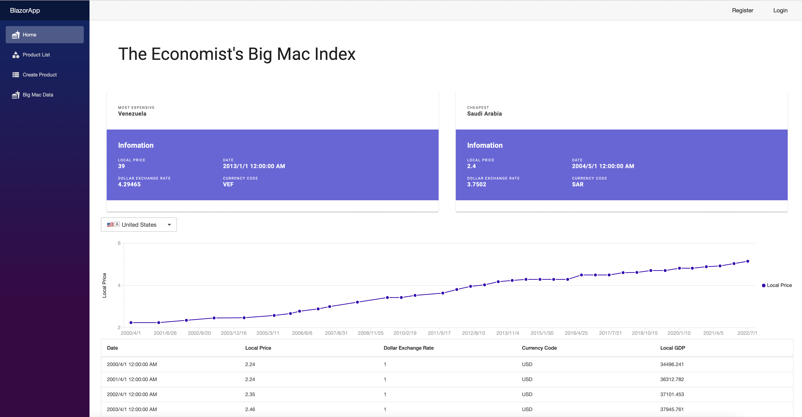

# Blazor App with ASP.NET

This Blazor web application is built using ASP.NET and includes three main pages: Home, Product List, and Create Product.

## Home Page

The Home page of this application is designed to display data from [The Economist's Big Mac Index](https://www.kaggle.com/datasets/paultimothymooney/the-economists-big-mac-index) dataset. It utilizes C# to read data from a CSV file, processes it, and presents the information using charts and tables.

### Features
- Visualizes Big Mac Index data with line charts.
- Displays a table of Big Mac Index data with the ability to select different countries.
- Highlights the most expensive and cheapest Big Macs based on local price and the dollar exchange rate.

## Product List

The Product List page is intended to display a list of products retrieved from a MySQL database. It provides a user-friendly interface for browsing available products.

### Features
- Lists products from a MySQL database.
- Allows users to browse and view product details.

## Create Product Page

The Create Product page offers a form that enables users to add new products to the database. It simplifies the process of adding new products by providing input fields and an easy-to-use interface.

### Features
- A form for creating new product entries.
- User-friendly input fields for product details.

